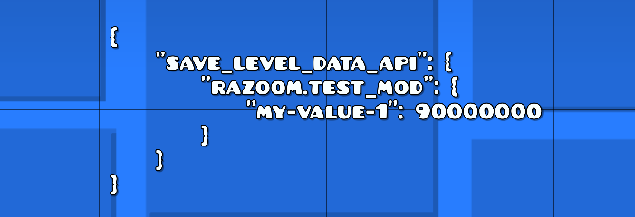

# Save Level Data API

*by RaZooM*


With this mod you can easily store and handle all level-specific data of your mod.

**Mod provides two saving options:**
- saving values to the local **save file** - your values will be available locally on your device
- saving values to the special **text object** inside the level – values that you save will be available to everyone even after sharing or publishing the level. If they also use your mod, they can access these values as well.


## Dependency

Add this to the dependencies in your `mod.json` file:

```json
"razoom.save_level_data_api": {
    "importance": "required",
    "version": ">=1.0.0"
}
```

And this to your `.cpp` file:
```cpp
#include <razoom.save_level_data_api/include/SaveLevelDataApi.hpp>
```


## Quick example

```cpp
#include <Geode/Geode.hpp>
#include <Geode/modify/EditorUI.hpp>

#include <razoom.save_level_data_api/include/SaveLevelDataApi.hpp>

using namespace geode::prelude;

class $modify(EditorUI) {
    bool init(LevelEditorLayer* editorLayer) {
        if (!EditorUI::init(editorLayer)) return false;

        // saving value
        SaveLevelDataAPI::setSavedValue(
            editorLayer->m_level,   // GJGameLevel*
            "my-value",             // key
            90000000,               // value (can be any json-serializable type)
            true,                   // save to the save file (default: true)
            true                    // save to the text object inside the level (default: false)
        );

        // getting value
        geode::Result<matjson::Value> result = SaveLevelDataAPI::getSavedValue(
            editorLayer->m_level,   // GJGameLevel*
            "my-value",             // key
            true,                   // get value from the save file (default: true)
            true                    // get value from the text object if wasn't found in the save file (default: false)
        );

        int value = result.unwrapOrDefault().asInt().unwrapOr(0);
        log::info("value: {}", value); // value: 90000000

        return true;
    }
};
```

## API Reference

```cpp
static void setSavedValue(
    GJGameLevel* level, 
    std::string_view key, 
    matjson::Value const &value, 
    bool saveInSaveFile = true,
    bool saveInTextObject = false,
    geode::Mod* mod = geode::getMod()
);
```
Save a value for the level:
- `level` - the level
- `key` - unique key of your value
- `value` - value of any JSON-serializable type (read matjson [docs](https://github.com/geode-sdk/json))
- `saveInSaveFile` - if value should be stored in the save file of YOUR mod
- `saveInTextObject` - if value should be stored in the special text object inside the level
- `mod` - mod

___

```cpp
static geode::Result<matjson::Value> getSavedValue(
    GJGameLevel* level, 
    std::string_view key, 
    bool checkSaveFile = true,
    bool checkTextObject = false,
    geode::Mod* mod = geode::getMod()
);
```
Get previously saved value for the level:
- `level` - the level
- `key` - unique key of your value
- `checkSaveFile` - if value should be taken from the save file of YOUR mod
- `checkTextObject` - if value should be taken from the special text object inside the level
    - If both `checkSaveFile` and `checkTextObject` are set to `true`, the it checks the save file first. If the value is not found there, it then checks the text object.
- `mod` - mod
- **returns**: the value or Err() if wasn't found


## Important notes!

- If you save/get data to/from the text object (e.g `SaveLevelDataAPI::setSavedValue(?, ?, ?, ?, true)`) the level must be currently opened in the editor and `LevelEditorLayer::get()` must be not null

- If you save data to the text object you must do it before the `EditorPauseLayer::saveLevel()` call. For example if you call `SaveLevelDataAPI::setSavedValue` in the EditorUI->m_fields destructor, yoru values won't be saved

- If you save/get data to/from the save file (e.g `SaveLevelDataAPI::setSavedValue(?, ?, ?, true, ?)`) you can do it from **any** place in the game

- Note that neither the text object nor the save file is updated instantly after you call `setSavedValue` - save file is updated when you exit the game (unless game crashes); text object is updated with the level saving (`EditorPauseLayer::saveLevel()`)


## How it stores the data

- In the save file of your mod:

  _which is: `C:\Users\<user>\AppData\Local\GeometryDash\geode\mods\<your_mod>\saved.json` on Windows_

  ```jsonc
  {
      "save_level_data_api": {    // <--- root object for all values saved with Save Level Data API
          "12291": {        // <--- level internal id (assigned by the Editor Level ID API mod)
              "my-value-1": 90000000    // <--- value that you've saved
          },
          "12351": {
              "my-value-1": 23423435,
              "other-value": "hello",
          }
      },
    
      // other saved values of your mod
  }
  ```

- In the text object inside the level:

  This object is placed at (x,y) = (-9999,-9999). If you want to inspect this object, enable positioning to (0,0) in the mod settings

  


## Bugs, questions

Please report any bugs here (in github issues) or on my [Discord](https://discord.gg/wcWvtKHP8n) server. Or ask me any questions if you have.
 
